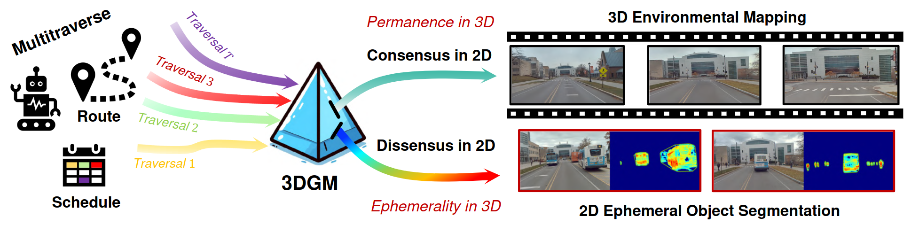

<div align="center">   
  
# 3D Gaussian Mapping (3DGM): Simultaneous 2D Segmentation and 3D Mapping with Self-Supervision
</div>


> **Memorize What Matters: Emergent Scene Decomposition from Multitraverse**, Technical Report.

> [Yiming Li](https://scholar.google.com/citations?hl=en&user=i_aajNoAAAAJ&view_op=list_works&sortby=pubdate), [Zehong Wang](), [Yue Wang](https://scholar.google.com/citations?user=v-AEFIEAAAAJ&hl=en), [Zhiding Yu](https://scholar.google.com/citations?user=1VI_oYUAAAAJ&hl=en), [Zan Gojcic](https://scholar.google.com/citations?user=8KsqL4gAAAAJ&hl=en), [Marco Pavone](https://scholar.google.com/citations?user=RhOpyXcAAAAJ&hl=en), [Chen Feng](https://scholar.google.com/citations?user=YeG8ZM0AAAAJ&hl=en), [Jose M. Alvarez](https://scholar.google.com/citations?user=Oyx-_UIAAAAJ&hl=en)

>  [[PDF]](https://arxiv.org/pdf/2405.17187) [[Project]](https://3d-gaussian-mapping.github.io/) 


# News
- [2024/05]: Our paper is on [arxiv](https://arxiv.org/abs/2405.17187). We will release our data and code soon!
</br>


# Abstract
Humans naturally retain memories of permanent elements, while ephemeral moments often slip through the cracks of memory. This selective retention is crucial for robotic perception, localization, and mapping. To endow robots with this capability, we introduce 3D Gaussian Mapping (3DGM), a self-supervised, camera-only offline mapping framework grounded in 3D Gaussian Splatting. 3DGM converts multitraverse RGB videos from the same region into a Gaussian-based environmental map while concurrently performing 2D ephemeral object segmentation. Our key observation is that the environment remains consistent across traversals, while objects frequently change. This allows us to exploit self-supervision from repeated traversals to achieve environment-object decomposition. More specifically, 3DGM formulates multitraverse environmental mapping as a robust differentiable rendering problem, treating pixels of the environment and objects as inliers and outliers, respectively. Using robust feature distillation, feature residuals mining, and robust optimization, 3DGM jointly performs 3D mapping and 2D segmentation without human intervention. We build the Mapverse benchmark, sourced from the Ithaca365 and nuPlan datasets, to evaluate our method in unsupervised 2D segmentation, 3D reconstruction, and neural rendering. Extensive results verify the effectiveness and potential of our method for self-driving and robotics. 


# Method

|  | 
|:--:| 
| ***Figure 1. Overall framework of 3DGM**. Given multitraverse RGB videos, 3DGM outputs a Gaussian-based environment map (EnvGS) and 2D ephemerality segmentation (EmerSeg) for the input images. Note that the proposed framework is LiDAR-free and self-supervised.* |


# Dataset

We build the Mapping and segmentation through multitraverse (Mapverse) benchmark, sourced from the Ithaca365 and nuPlan datasets to evaluate our method in three tasks: unsupervised 2D segmentation, 3D reconstruction, and neural rendering. 
Mapverse features 40 locations, each with no less than 10 traversals, totaling 467 driving video clips and 35,304 images. 

# Bibtex
If this work is helpful for your research, please cite the following BibTeX entry.

```
@misc{li2024memorize,
      title={Memorize What Matters: Emergent Scene Decomposition from Multitraverse}, 
      author={Yiming Li and Zehong Wang and Yue Wang and Zhiding Yu and Zan Gojcic and Marco Pavone and Chen Feng and Jose M. Alvarez},
      year={2024},
      eprint={2405.17187},
      archivePrefix={arXiv},
      primaryClass={cs.CV}
}
```
